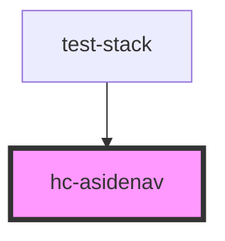

# hc-asidenav

<!-- Auto Generated Below -->

## Properties

| Property     | Attribute     | Description | Type      | Default     |
| ------------ | ------------- | ----------- | --------- | ----------- |
| `avatar`     | `avatar`      |             | `string`  | `undefined` |
| `avatarLink` | `avatar-link` |             | `string`  | `'/'`       |
| `copyright`  | --            |             | `Date`    | `undefined` |
| `isExample`  | `is-example`  |             | `boolean` | `undefined` |

## Dependencies

### Used by

 - [test-stack](../test-stack)

### Graph

----------------------------------------------

*Built with [StencilJS](https://stenciljs.com/)*
