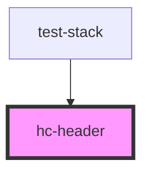

# hc-header

<!-- Auto Generated Below -->

## Properties

| Property     | Attribute     | Description | Type     | Default                                          |
| ------------ | ------------- | ----------- | -------- | ------------------------------------------------ |
| `avatar`     | `avatar`      |             | `string` | `'http://fakeimg.pl/50x50?text=A&font=bebas'`    |
| `avatarLink` | `avatar-link` |             | `string` | `'/'`                                            |
| `linkClass`  | `link-class`  |             | `string` | `''`                                             |
| `resumeLink` | `resume-link` |             | `string` | `'assets/docs/NicholasTillman_resume_2023.docx'` |
| `siteURL`    | `site-u-r-l`  |             | `string` | `''`                                             |
| `token`      | `token`       |             | `string` | `''`                                             |

## Dependencies

### Used by

 - [test-stack](../test-stack)

### Graph

----------------------------------------------

*Built with [StencilJS](https://stenciljs.com/)*
