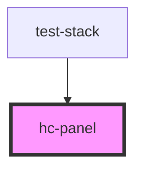

# hc-panel

<!-- Auto Generated Below -->

## Properties

| Property | Attribute | Description | Type                                    | Default     |
| -------- | --------- | ----------- | --------------------------------------- | ----------- |
| `as`     | `as`      |             | `string`                                | `undefined` |
| `size`   | `size`    |             | `"lg" \| "md" \| "sm" \| "xl" \| "xxl"` | `undefined` |
| `tokens` | `tokens`  |             | `string`                                | `undefined` |

## Dependencies

### Used by

 - [test-stack](../test-stack)

### Graph

----------------------------------------------

*Built with [StencilJS](https://stenciljs.com/)*
