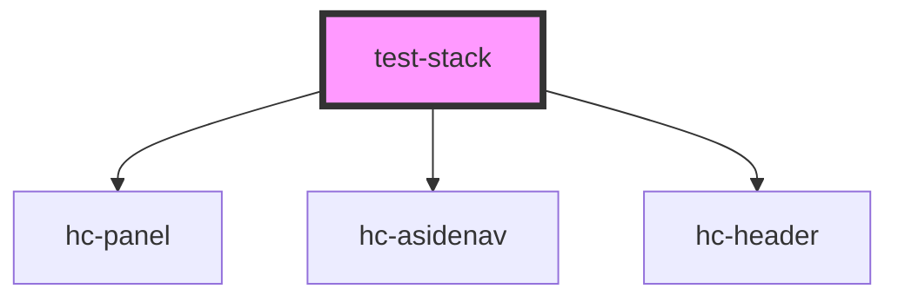

# test-stack

<!-- Auto Generated Below -->

## Properties

| Property | Attribute | Description | Type       | Default                                   |
| -------- | --------- | ----------- | ---------- | ----------------------------------------- |
| `items`  | --        |             | `string[]` | `['hc-asidenav', 'hc-panel', 'hc-stack']` |

## Dependencies

### Depends on

- [hc-panel](../hc-panel)
- [hc-asidenav](../hc-asidenav)
- [hc-header](../hc-header)

### Graph

----------------------------------------------

*Built with [StencilJS](https://stenciljs.com/)*
